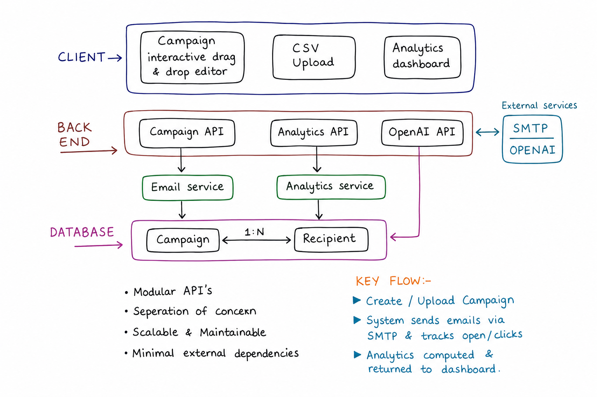
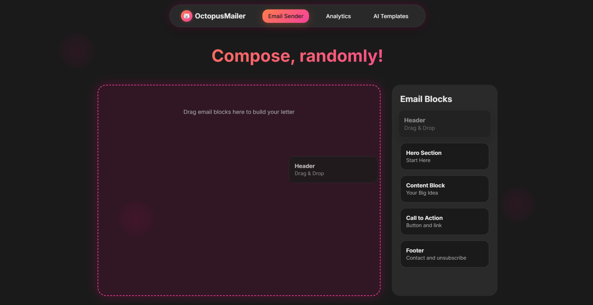
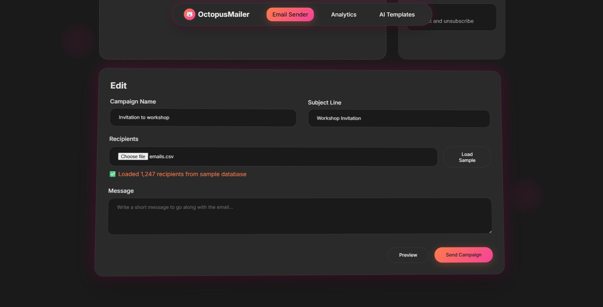
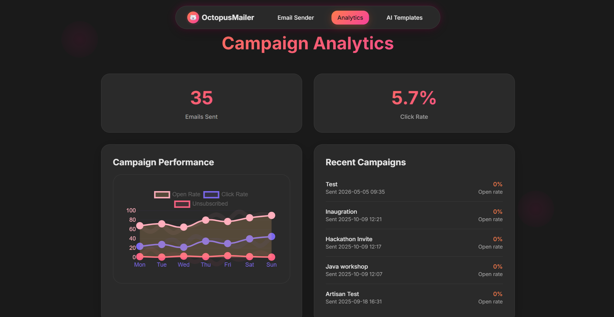
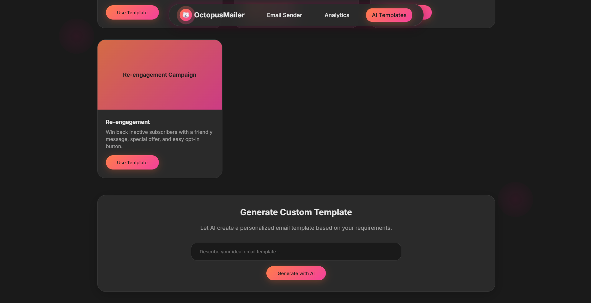

# OctopusMailer 🐙

### Bulk email campaigns with passive open & click tracking - no third-party service required.

> AI-assisted template generation | Interactive drag-and-drop email editor | Pixel-based tracking | Per-campaign analytics

---

<div align="center">


</div>

---

## Features

- Send bulk HTML email campaigns via SMTP
- AI email template generation using OpenAI (`gpt-4o-mini`)
- Email customization using a drag-and-drop email builder
- Open & click tracking using tracking pixels and redirect analytics
- CSV recipient upload and parsing
- Modular Flask API architecture
- SQLAlchemy ORM integration

---

## Architecture

<p align="center">
  
</p>

### 1. Client Layer

The frontend acts as the interaction layer where users can:

- Create campaigns using a drag-and-drop editor
- Upload recipient CSV files
- View campaign analytics and engagement metrics

The client communicates with the backend only through REST API endpoints.

<p align="center">
  
</p>

<p align="center">
  
</p>

---

### 2. Backend API Layer

The Flask backend is split into modular APIs:

- **Campaign API** → handles campaign creation and recipient uploads
- **Analytics API** → tracks opens/clicks and returns engagement metrics
- **OpenAI API** → generates AI-assisted email content

<p align="center">
  
</p>

<p align="center">
  
</p>

---

### 3. Service Layer

Business logic is isolated inside dedicated services:

- **Email Service** → manages bulk email delivery and tracking integration
- **Analytics Service** → computes open rates, click metrics, and dashboard statistics

---

### 4. Database Design

The system uses a relational SQLite schema with a clear `1:N` relationship:

- One `Campaign`
- Many `Recipients`

Each recipient stores tracking metadata such as:

- Opened status
- Clicked status
- Engagement timestamps

This structure supports analytics computation while maintaining normalized relational modeling.

---

### 5. External Integrations

The architecture integrates with:

- SMTP for email delivery
- OpenAI API for AI-generated campaign content

External services remain isolated from core business logic through dedicated API/service boundaries.

---

## Design Principles

- Modular API architecture
- Separation of concerns
- Service-oriented backend design
- Relational database modeling
- Minimal external dependencies
- Scalable and maintainable structure

---

## Setup

### 1. Clone & install dependencies

```bash
git clone https://github.com/yourname/octopusmailer.git
cd octopusmailer
pip install -r requirements.txt
```

### 2. Configure environment

Create a `.env` file in the project root:

```env
OPENAI_API_KEY=sk-...
SMTP_HOST=smtp.gmail.com
SMTP_PORT=587
SMTP_USER=you@gmail.com
SMTP_PASS=yourpassword
DATABASE_URL=sqlite:///
```

### 3. Run the application

```bash
python app.py
```

The app runs at:

```text
http://localhost:5000
```

---

## Tech Stack

Python • Flask • SQLAlchemy • SQLite • SMTP • OpenAI API • HTML • CSS • JavaScript

---

## Prototype Demonstration

https://youtu.be/gGtziIVxYOI?si=fw4IBgyJXKpzLQmq
